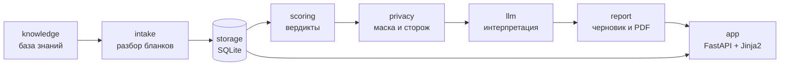

# Как устроен Health Coaching

*README рассказывает, как работать с инструментом. Этот документ — о том, как
инструмент устроен и почему он устроен именно так.*

---

## Идея

Health coaching специалист получает от клиента запрос, анкету и пачку
лабораторных бланков — PDF из личных кабинетов и фотографии, снятые на
телефон. Дальше начинается ручная работа: перенести показатели, сверить
каждый со своими целевыми коридорами, собрать из находок связный отчёт,
который клиент сможет прочитать без медицинского образования.

Этот инструмент забирает механическую часть работы, не забирая суждение.
Он распознаёт бланки, сверяет показатели с базой знаний коуча, собирает
черновик отчёта — и на каждом шаге ждёт подтверждения человека. Ничего не
попадает в находки без сверки, ничего не уходит модели без вычитки, ничего
не достаётся клиенту без утверждения.

И всё это — на машине специалиста. Ни сервера, ни регистрации, ни
медицинских данных у третьих лиц: база — один файл SQLite, распознавание
фотографий — системный движок macOS, работающий оффлайн, языковая модель —
Claude Code на подписке коуча. Резервная копия — копия папки.

## Главный принцип: инструмент не угадывает

Одна фраза, из которой выводится почти каждое решение в коде:

- Название показателя не распозналось — строка показывается текстом,
  а не подменяется похожей.
- В бланке `<0.60` — сохраняется текст `<0.60`, а не число `0.60`.
- Единицы не сопоставлены — показатель честно получает статус
  «единицы не сопоставлены», а не считается «примерно тем же».
- Слово в шапке таблицы распознано с опечаткой — документ не
  раскладывается молча: инструмент показывает свою догадку и ждёт «да».
- Приложено заключение УЗИ вместо таблицы анализов — отказ с внятной
  причиной, а не жалоба на непонятные колонки.
- Составляющие производного индекса сданы в разные визиты — индекс
  не считается, и черновик называет причину: сложить мартовское значение
  с августовским и выдать индекс, как будто оба сданы разом, было бы
  неправдой.

Отказ всегда адресный: пустой PDF лечится не так, как УЗИ вместо анализов,
и сообщения об ошибке это различают.

## Архитектура

Восемь пакетов, связанных строго в одну сторону — от чистой базы знаний к
веб-интерфейсу:



| Пакет | Что делает |
|---|---|
| `knowledge/` | Загрузка и валидация YAML-базы знаний: показатели, коридоры, единицы, опросник на 544 вопроса, справочник специалистов |
| `intake/` | Превращает файл клиента в измерения: PDF через pdfplumber, фото через macOS Vision, разбор таблицы по шапке, распознавание показателя в базе знаний |
| `storage/` | SQLite: девять таблиц, миграции одной транзакцией, репозитории с доменными инвариантами |
| `scoring/` | Детерминированные вердикты: сверка с коридорами, баллы опросника, производные индексы по формулам |
| `privacy/` | Три рубежа: вычистка-помощник, сторож утечки без выключателя, единая маска находок |
| `llm/` | Вызов Claude Code в headless-режиме за интерфейсом из одного метода |
| `report/` | Восемь разделов черновика, SVG-графики динамики, PDF через WeasyPrint |
| `app/` | Веб-интерфейс: рабочий стол, карточки клиентов, срезы, сверка, находки, отчёт |

## Путь одного бланка

1. Коуч прикладывает PDF или фотографию к срезу — одному визиту клиента.
2. Текст достаётся из PDF построчно; с фотографии его читает Apple Vision,
   а строки таблицы собираются из отдельных наблюдений по вертикальной
   координате — движок отдаёт боксы, а не строки.
3. Разбор находит шапку таблицы по словарю известных слов с нечётким
   сопоставлением. Незнакомое слово в шапке — отказ от документа целиком;
   слово с опечаткой — экран подтверждения догадки.
4. Каждая строка делится на название, значение, единицы. Название ищется
   в базе знаний в две попытки: уточнённые формы раньше общих, чтобы
   «Лимфоциты, абс.» не выдали себя за проценты.
5. Нераспознанные строки показываются текстом — коуч вписывает их руками.
6. Коуч сверяет каждый показатель. Несверенное в находки не попадает.
7. Скоринг выносит вердикты по целевым коридорам — коридор выбирается по
   полу и возрасту **на дату забора крови**, а не на дату отчёта.
8. Запрос клиента вычитывается: автоматическая чистка предлагает убрать
   имя, контакты и даты, коуч утверждает результат.
9. Модель восемь раз получает один и тот же payload — находки, посчитанные
   кодом, с пометкой «не пересчитывать» — и пишет по разделу за вызов.
10. Коуч правит черновик и утверждает. Утверждённое замораживается.
11. PDF собирается WeasyPrint: текст модели, таблица чисел, посчитанных
    кодом, и SVG-графики динамики, нарисованные без единой библиотеки.

## База знаний — YAML на русском

Код проекта на английском, домен — на русском: показатели, единицы, условия
коридоров и даже операнды формул названы так, как о них говорит специалист.

```yaml
показатели:
  - id: ферритин
    название: Ферритин
    синонимы: [Ферритин, Ferritin, S-Ferritin]
    единицы: нг/мл
    синонимы_единиц: [мкг/л, ug/L, ng/mL]
    лабораторный_интервал: [10, 120]
    трактовать_с: [срб]
    заметка: Растёт при воспалении — смотреть вместе с СРБ
    целевые:
      - условие: {пол: ж, возраст: [18, 50]}
        оптимум: [60, 90]
        дефицит: [null, 30]
      - условие: {пол: м}
        оптимум: [80, 150]
        дефицит: [null, 40]
      - оптимум: [60, 120]          # запасное правило, без условия
        дефицит: [null, 30]

производные:
  - id: кальций_калий
    название: Соотношение кальций/калий
    формула: кальций / калий
    оптимум: [2.0, 4.0]
```

Несколько правил, за каждым из которых стоит причина:

- **`синонимы_единиц` и `пересчёт` — разные механизмы**, и одна единица не
  может стоять в обоих. Синонимы — написания одной величины, без
  арифметики; пересчёт — множитель, объявленный коучем явно. Общей таблицы
  пересчётов «на все случаи» нет намеренно: перевод массы в моли зависит
  от молярной массы, а считать инструмент не вправе то, что не задано.
- **Целевой коридор — врачебное суждение**, и у большинства показателей он
  пуст сознательно: придумывать его за специалиста инструмент не вправе.
  Показатель без коридора всё равно узнаётся и попадает в динамику, а
  список «нет правила в базе знаний» служит рабочим списком — чем
  пополнить базу.
- **Формулы производных разбираются по AST с белым списком узлов** — имена,
  числа, четыре операции. Никакого `eval`: формулы приходят из данных, а
  данные не должны уметь выполнять код.
- **Перевёрнутый интервал не создаётся вовсе** — конструктор бросает
  ошибку. Раньше опечатка `[90, 60]` молча рисовала график с отрицательной
  высотой полосы.

## Три рубежа приватности

Приватность здесь — не настройка, а архитектура.

1. **Вычистка — помощник.** Убирает из текста запроса то, что знает про
   конкретного клиента: имя, дату рождения в четырёх записях, контакты,
   длинные последовательности цифр. Возвращает не только чистый текст, но
   и список убранного — чтобы коуч видел работу и мог возразить. Задача
   «убрать все персональные данные» нерешаема, и инструмент это признаёт:
   «работаю в школе № 1234» не поймает никакое правило — поэтому вычитка
   остаётся за человеком.
2. **Сторож — защита.** Перед отправкой модели готовый текст проверяется
   на те же «иголки», и при находке отправка падает с названной причиной.
   У сторожа нет параметра, отключающего проверку, и в докстроке записано,
   что добавлять его запрещено: отладочный флаг однажды останется
   включённым. Проверка зовётся внутри сборки payload — дописать текст
   после неё физически негде.
3. **Маска — одна на оба пути наружу.** Заголовки и единицы, списанные с
   бланка, закрыты и для модели, и для клиента: в них могут стоять
   фамилии. Заметка коуча уходит модели как клиническая рамка, но не
   попадает в клиентский PDF. Имена доверенных врачей не покидают базу
   знаний вообще — наружу уходят только специальности.

Кроме того: табло качества распознавания печатает файлы номерами, а не
именами — в именах файлов стоят фамилии пациентов; строка «ФАМИЛИЯ ИМЯ
ИБ №» отсеивается при разборе, чтобы фамилия не осела в базе под видом
показателя.

## Модель трактует, код считает

Граница проведена жёстко. Все числа — вердикты, баллы опросника,
производные индексы, проценты шкал — считает код, детерминированно и под
тестами. Модель получает готовые находки с пометкой «посчитаны кодом, не
пересчитывать» и пишет текст. В клиентском PDF рядом с текстом модели
печатается таблица чисел, посчитанных кодом, — опечатка модели «180 нг/мл»
вместо «18» не пройдёт без возражений.

Сама модель — Claude Code в headless-режиме на подписке коуча, без оплаты
по токенам. Движок спрятан за интерфейс из одного метода и «меняется
целиком, не по частям». Любой сбой — таймаут, пустой ответ, невалидный
JSON — останавливает сборку целиком: половина черновика хуже отказа.

## Что ещё стоит заметить

- **Комментарии в коде объясняют не «что», а «какой баг это
  предотвращает»**. Почти каждая константа несёт историю: почему список
  пометок лаборатории закрытый (иначе «ТВ» — тромбиновое время — стало бы
  пометкой), почему порог опечаток в шапке именно три колонки (иначе
  «динамика значений» — обычная русская фраза — объявилась бы таблицей).
  Это встроенный в код журнал регрессий.
- **Миграции базы — одной явной транзакцией**, с перечитыванием версии
  внутри неё: соединение открывается на каждый HTTP-запрос, и два запроса
  могут застать базу одной версии. Прерванное обновление откатывается
  целиком.
- **Заморозка утверждённого — доменный инвариант, а не проверка в UI.**
  Репозитории сами отказывают в записи поверх утверждённого: между
  проверкой в маршруте и записью утверждение могло пройти во второй
  вкладке.
- **Порог заполненности опросника — две трети.** Пропущенный вопрос
  считается за ноль, а больше баллов — хуже: каждый пропуск смещает
  клиента в сторону здорового, поэтому по полупустой шкале степень не
  выносится вовсе.
- **Качество распознавания измеряется, а не ощущается.** Команда
  `python -m healthcoach.intake.corpus` считает по архиву реальных выгрузок,
  сколько документов принято и сколько строк узнала база знаний; тест
  пломбирует достигнутый порог. История в коммитах: от 29 принятых
  документов из 77 — до 43 из 70 с 567 сопоставленными строками.
- **Значок приложения рисуется прямо в скрипте сборки** — PNG пишется
  через zlib руками, чтобы проект не обзавёлся зависимостью ради одной
  картинки, а коуч запускал инструмент двойным щелчком из Dock.
- **README честен о недоделанном**: PDF пересобирается при каждом
  скачивании, и правка базы знаний может изменить числа в уже выданном
  отчёте — это названо прямо, с пометкой «следующий шаг, ещё не сделанный».

## Проект в числах

| | |
|---|---|
| Код | ~8 100 строк Python, 34 модуля в 8 пакетах |
| Тесты | 793 теста в 52 файлах, ~14 000 строк — примерно 1.7 строки тестов на строку кода |
| База знаний | ~75 показателей в 8 YAML-файлах; опросник — 24 блока, 544 вопроса |
| Проектная документация | ~13 500 строк: спецификация MVP и девять планов реализации в `docs/superpowers/` |
| Зависимости | 9 прямых (из них 2 только для macOS) |
| Интерфейс | FastAPI + Jinja2, без единой строки JavaScript-фреймворков |

Живой вызов модели в тестах вынесен под отдельный маркер и исключён из
обычного прогона — иначе каждый `pytest` молча тратил бы лимиты подписки.

---

*Проект разработан вместе с Claude Code: спецификация и планы реализации в
`docs/superpowers/` — исполняемые, с чек-боксами, интерфейсами и тестами
по каждой задаче.*
